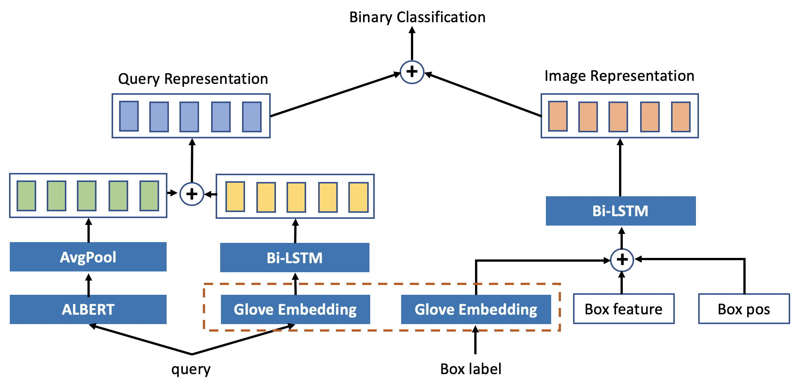

# KDD Cup 2020 Challenges for Modern E-Commerce Platform: Multimodalities Recall

## 简介

这次KDD CUP比赛聚焦多模态召回，比赛准备了来自移动电子商务平台的真实场景多模态数据。该数据集由搜索查询和产品图像特征组成，并组织成一个基于查询的多模式检索任务。我们需要实现一个模型，根据候选产品的图像特性对它们进行排序。这些查询大部分是名词短语，搜索具有特定特征的产品。候选产品的图片由卖家的展示图片提供，通过黑箱功能转换成2048维的特征。与查询最相关的候选产品作为查询的ground truth，参与模型期望将其排在最前面。

## 成绩

Track B: 0.628 

Rank: 23/1433 

## 模型

模型结构：

模型采用双塔结构，对query和img box feature分别提取特征，最后添加MLP分类层。

query feature:

+ 为节省内存，基于ALBET提取query句子级别特征表示，具体为将query经过ALBERT后拿倒数第二隐含层的输出做平均池化后得到的向量作为query的embedding representation。
+ 基于Glove和双向lstm提取query的句子级别特征表示，并与ALBET提取query句子特征拼接得到最后的query representation，dim=896。

image feature:

+ 基于Glove对box label做token embedding，把所有token embedding做平均作为box label的embedding representation。
+ 拼接box label、box feature和box position向量。
+ 用双向lstm对拼接后的向量做特征提取，最后得到image representation，dim=1024。

## 负采样

**基于box label做负采样，核心思想是使负样本和正样本中有共同的box label，这样使得正负样本在img上具有一定的相似性，也可理解为一种困难样本的挖掘。但是这样只考虑了img上的相似而没要考虑query的相似，排名第一的解决方案就是考虑query的相似性来构造负样本集。**

## 训练

+ 由于内存限制，每次处理10万个样本，将10万个样本做预处理：albert/glove embedding，然后保存数据。
+ 每次负采样和shuffle均在这10万个样本内发生。
+ 参数
  + Learning rate = 2e-4
  + Batch size = 1000（设的比较大也是想训练快一点）
  + Loss = Cross Entropy Loss
  + Optimizer = Adam
  + MAX_BOX = 12
  + MAX_QUERY_CHAR = 14

##### 负样本训练策略 

本次比赛positive : negative 在1：6~ 1 : 12比较好，但受制于机器，为了尽快跑完一个epoch，所以设定了一个特别的训练策略：在每轮训练的时候，仍然采取1：1采样比例，但是每个epoch采样的随机种子值不一样，这样每轮训练的负样本也是不一样，经试验验证该策略训练效果基本等效于负样本过采样。

## 一些思考

+ 有不少优秀的解决方案的模型中包含了tranformer结构，我认为这是一种能够较好地交互模态内和模态间特征的方式，本人也尝试过叠加transformer层但在小规模数据集上未有明显提升（当时负采样也有问题），如果能在大规模语料上训练并且改变采样方式，也许会有不同的结果。
+ 负采样的方式比较关键，要尽量构造与真实负样本分布相似的假负样本，这个可以通过分析valid.tsv发现规律。

## 他山之石

看过一些优秀方案后发现可以借鉴的亮点：

+ 排名第1的方案
  + 微调MCAN, VisualBERT模型。
  + 根据tf-idf选相近的query进行负采样。
  + 后处理：利用验证集训练一个新的分类器，模型采用LightGBM。 相当于在前期训练好的模型下再接了一个模型，然后训练一个task。
  + 不同随机负采样下训练数十多个模型然后集成。
  + 使用Focal Loss function，**这个函数可以通过减少易分类样本的权重，使得模型在训练时更专注于难分类的样本。**

+ 排名第10的方案：

  + 该方案最大的特点是没有采取正负样本二分类的模式，而是通过计算img与query 的相似程度得到匹配排序。

  + 预训练：以图片作为输入，进行多标签分类。
  + 预训练：以图片作为输入，进行文本生成。

+ 排名第12的方案
  + 轻量级bert
  + 根据规则去除异常样本
  + 使用 **Local-Linear-Embedding-like method**

## 参考

第1名解决方案：

+ [KDD_WinnieTheBest](https://github.com/steven95421/KDD_WinnieTheBest) 

第10名解决方案：

+ [垫底小分队](https://github.com/IntoxicatedDING/KDD-Cup-Multimodalities-Recall)

第12名解决方案：

+ [ChengxuanYing](https://github.com/chengsyuan/KDD-Multimodalities-Recall/tree/adfb5e4227e57450e1d0fa58cbf50e102f741592)

其他：

+ [Ai-Light](https://github.com/Ai-Light/KDD2020Multimodalities)

